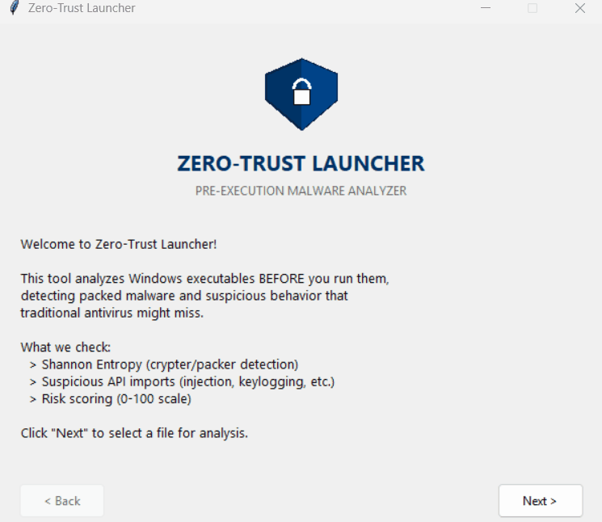

# Zero-Trust Launcher

Pre-execution malware analyzer using static analysis (Shannon entropy, PE imports, PyInstaller detection).




## Quick Start

```bash
git clone https://github.com/darama22/ZeroTrustLauncher.git
cd ZeroTrustLauncher
pip install -r requirements.txt
python launcher.py
```

**Requirements:** Python 3.7+, Windows

## Features

- Shannon entropy analysis (detects packing)
- PE import scanning (suspicious APIs)
- PyInstaller bytecode detection
- Risk scoring: 0-100 (LOW/MEDIUM/HIGH)
- Educational vulnerability explanations

## Validation

| File | Type | Score | Status |
|------|------|-------|--------|
| calc.exe | Legitimate | 0/100 | ✅ |
| Valorant.exe | Packed game | 31/100 | ✅ |
| Cheat Engine | Memory tool | 28/100 | ✅ |
| malware_test.exe | PyInstaller malware | 56/100 | ✅ |
| msfvenom payload | Advanced shellcode | 0/100 | ⚠️ * |

**\*** Limitation: Advanced shellcode with API hashing requires dynamic analysis.

## How It Works

**Entropy:** High (>7.2) = packed/encrypted  
**APIs:** Scans for `WriteProcessMemory`, `VirtualAlloc`, `GetAsyncKeyState`, `exec`, `subprocess`, etc.  
**Scoring:** Entropy penalty + API penalties = total risk

## Limitations

Static analysis only. Cannot detect:
- Advanced shellcode (API hashing)
- Polymorphic malware
- Fileless malware

**Use for:** Pre-screening, education, common malware detection  
**Not for:** APTs, zero-days, replacing antivirus

## License

Educational purposes only.
